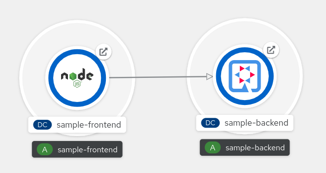
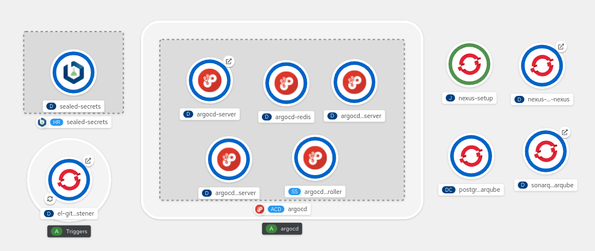
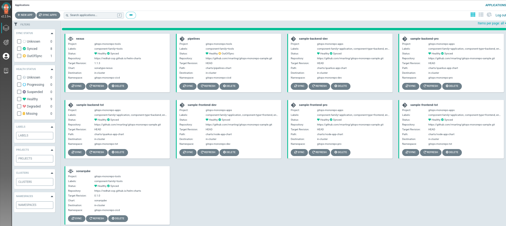

# GitOps Product Monorepo Sample

Developing cloud native products following Agile, and DevOps practices could require
to use different approaches, patterns and processes to do it in a fast pace. Many of the
most common patterns in this space are:

* Product Monorepo
* Trunk-based development
* GitOps
* Cloud Native Application
* Continuous Integration, Continuous Delivery and Continuous Deployment
* Sealed Secrets

Use all of them at the same time could be a challenge for a new team, but it is possible
getting the best benefits from each of them. I have working in many different use cases and products
for a long time, many times using these patterns in somehow, learning from the pitfalls, and
getting the best benefits. This repo represents an *opinionated* manner to 
do it for a new product team, combining all these practices in the same place. 

Hoping this approach could help in your use case. Use carefully all the assess, and land into
your specif use case.

The `product` is the software solution created for a business scenario, adding the value and solution
to achieve the goals of the business. We build software to resolve business scenarios.

:exclamation: Soon a blog post will try to clarify many of the aspects related with this repo. Stay tunned!:exclamation:

## Product Monorepo

Product [Monorepo](https://en.wikipedia.org/wiki/Monorepo) means to have everything related with a software product
in one single place, shared with the product team, to implement the full Software Delivery Life cycle of the product.

One of the most important topics for a Product Monorepo is to have a clear folder structure, otherwise
you could get a chaotic layout with more pains that gains.

This repo is organized as:

* [bootstrap](./bootstrap/README.md) folder includes the initial components to setup the environment, mainly
tools to define the base of the rest of the solution.
* [apps](./apps/) folder includes the list of applications or components of the product.
* [charts](./charts/README.md) folder includes the Helm Charts to accelerate the deployment of any component,
tool or application related with the product.
* [argocd](./argocd/README.md) folder includes the items related with ArgoCD and GitOps.
* [tekton](./tekton/README.md) folder includes the items related with Tekton and Pipelines.
* [e2e-test](./e2e-test/README.md) folder includes the end-to-end test suites of the product.

## Trunk-based Development

A Monorepo is a specific [Trunk-Based Development](https://trunkbaseddevelopment.com/) implementation where
the product team puts its source for all applications/services/libraries/frameworks into one repository and
forces team members to commit together in that trunk - atomically.

The `trunk` branch is defined basically as productive and any change merged there is candidate to be deployed
in any environment, including production. There are not any other starting point to promote changes, as everything
is integrated in the trunk. Other branches are considered ephemeral, to manage short pieces of changes, with
a review process (by [pair programming](https://openpracticelibrary.com/practice/pair-programming/) or by a
Pull Request) before to be merged into the trunk.

This method allows the team members to develop fast small chunks (many times as [features flags](https://openpracticelibrary.com/practice/feature-toggles/)
or not), with sooner integrations cycles, reducing merge conflicts, and promoting changes to others faster.

## GitOps

[GitOps](https://openpracticelibrary.com/practice/gitops/) defines the source of truth a Git repository,
where everything starts from there and defining the desired state of our product. 

## Cloud Native Application

Designing our product as a [Cloud Native](https://en.wikipedia.org/wiki/Cloud_native_computing) solution will bring us
many benefits in cloud environments. Most of the cases a Microservice architecture following the [Twelve-Factor App](https://12factor.net/)
methodology is the right starting point. Our product will implement that methodology.

## Continuous Integration, Continuous Delivery and Continuous Deployment

Any product in the new automated era must be done without the most well-known benefits of
[Continuous Integration](https://openpracticelibrary.com/practice/continuous-integration/),
[Continuous Delivery](https://openpracticelibrary.com/practice/continuous-delivery/) and
[Continuous Deployment](https://openpracticelibrary.com/practice/continuous-deployment/). Otherwise
you are failing from the beginning.

## Sealed Secrets

GitOps means **“if it’s not in Git, it’s NOT REAL”**, so it is a challenge to store sensitive data, like credentials,
in Git repositories, where many people can access?. OpenShift provides a good way to manage sensitive data in the platform, but
we need to extend it with other great tools to store sensitive data in Git without any break of security.

Here [Sealed Secrets](https://github.com/bitnami-labs/sealed-secrets) arrives to help us.

## Playing with our Product Monorepo

Now, it is time to play :game_die:. 

This repository defines a sample product with the following applications:

* A sample Angular application as frontend for the final users. Details [here](./apps/sample-frontend/README.md)
* A sample Quarkus application as backend to manage the *business logic* of our product. Details [here](./apps/sample-backend/README.md)

### Requirements

This repository had been developed and tested in the following environment:

* Red Hat OpenShift Container Platform 4.10
* Red Hat OpenShift GitOps 1.4.3 (ArgoCD)
* Red Hat OpenShift Pipelines 1.6.2 (Tekton)
* Sealed Secrets Helm Chart 1.16.1

### Bootstrapping Red Hat OpenShift Container Platform

To prepare your OCP environment, review and follow the [bootstrap instructions](./bootstrap/README.md)

If everything goes fine, your environment should look like as:

### GitOps with ArgoCD

To prepare the GitOps scenario with ArgoCD, review and follow the [instructions](./argocd/README.md).

If everything goes fine, your ArgoCD should look like as:

### CICD with Tekton Pipelines

This Product Monorepo has a set of different pipelines to cover the Software Delivery Life cycle, integrated
in our GitOps approach. The pipelines are described [here](./tekton/README.md).

## Feedback, Comments, and improvements

As this is an *opinionated* approach, from my field experience in real scenarios and use cases, I am always
open to learn from other experiences and use cases. Feel free to comment, improve or change my mind with your
great ideas. Don't forget to review our [Contribution Guide](./CONTRIBUTING.md) do it in many different
ways (issues, pull-request, comments, ...), don't miss the chance to do it.

I also open to share this approach, techniques and tools in community, meetup or simple group of colleagues around
topics such as DevOps, Agile, GitOps, Cloud Native, ... If you think that I can participate, please, let me know it.

If you are here, thank you so much. :smile: :tada:
