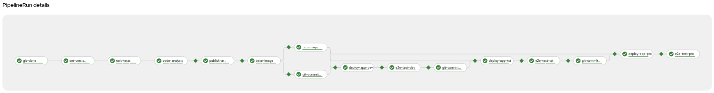
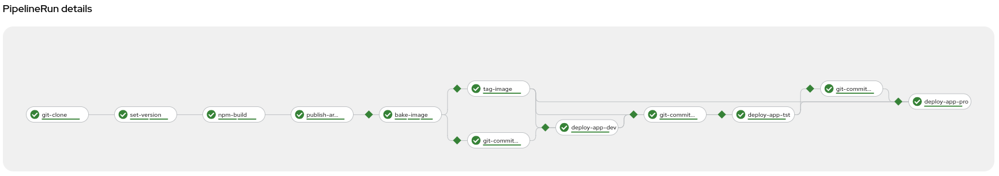
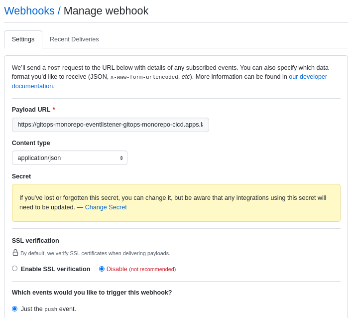

# GitOps Monorepo Sample - CICD Pipelines by Tekton

Our product uses a set of different CICD pipelines to cover the main tasks
to build, package, deploy and test the components in the final environments.

Each pipeline covers a set of different use cases, to have a full complete
solution of Continuous Integration, Continuous Delivery and Continuous Deployment.

## Pipelines

### Maven App CI-CD-CD pipeline

Pipeline to build and package a Maven application into an OpenShift namespace combining
Tekton Pipelines and ArgoCD deployments, promoting the application from a Development environment
to a Production environment.



This pipeline executes the main tasks:

* Clone Git Product Monorepo
* Set version
* Execute unit tests
* Quality analysis
* Publish artifact into Software Artifacts Repository
* Create Container image (Bake Image)
* Tag Image with the right version
* Update Git Product Monorepo with new version created for Development environment
* Update ArgoCD deployments to sync-up Development Environment
* Regression Tests in Development Environment
* Update Git Product Monorepo with new version created for Testing environment
* Update ArgoCD deployments to sync-up Testing Environment
* Regression Tests in Testing Environment
* Update Git Product Monorepo with new version created for Production environment
* Update ArgoCD deployments to sync-up Production Environment
* Regression Tests in Production Environment

This pipeline requires to define the following parameters:

* `CICD`: If true then enables a full CICD pipeline, otherwise a single CI pipeline. Default: `true`
* `PROJECT_NAME`: The project name. It will define the namespace to deploy
* `APP_NAME`: The application name
* `MONOREPO_GIT`: The monorepo git repository      
* `MONOREPO_GIT_REVISION`: The monorepo git revision. Default: `main`
* `MONOREPO_APP_CONTEXT_DIR`: The application source code context dir
* `APP_IMAGE`: The application image to build
* `JAVA_BUILDER_IMAGE`: Default Java Builder image. Default: `openshift/java:openjdk-11-el7`
* `NEXUS_URL`: Default Nexus Software Artifacts Repository
* `SONARQUBE_URL`: Default SonarQube
* `SONARQUBE_USER`: Default SonarQube User
* `SONARQUBE_PASS`: Default SonarQube User Password

There is a `PipelineRun` example to run as CI pipeline:

```shell
oc create -f runs/maven-app-ci-pipelinerun.yaml -n gitops-monorepo-cicd
```

There is a `PipelineRun` example to run as CICD pipeline:

```shell
oc create -f runs/maven-app-cicd-pipelinerun.yaml -n gitops-monorepo-cicd
```

### Node.JS App CI-CD-CD pipeline

Pipeline to build and package a Maven application into an OpenShift namespace combining
Tekton Pipelines and ArgoCD deployments, promoting the application from a Development environment
to a Production environment.



This pipeline executes the main tasks:

* Clone Git Product Monorepo
* Set version
* Publish artifact into Software Artifacts Repository
* Create Container image (Bake Image)
* Tag Image with the right version
* Update Git Product Monorepo with new version created for Development environment
* Update ArgoCD deployments to sync-up Development Environment
* Update Git Product Monorepo with new version created for Testing environment
* Update ArgoCD deployments to sync-up Testing Environment
* Update Git Product Monorepo with new version created for Production environment
* Update ArgoCD deployments to sync-up Production Environment

This pipeline requires to define the following parameters:

* `CICD`: If true then enables a full CICD pipeline, otherwise a single CI pipeline. Default: `true`
* `PROJECT_NAME`: The project name. It will define the namespace to deploy
* `APP_NAME`: The application name
* `MONOREPO_GIT`: The monorepo git repository      
* `MONOREPO_GIT_REVISION`: The monorepo git revision. Default: `main`
* `MONOREPO_APP_CONTEXT_DIR`: The application source code context dir
* `APP_IMAGE`: The application image to build
* `NEXUS_URL`: Default Nexus Software Artifacts Repository
* `SONARQUBE_URL`: Default SonarQube
* `SONARQUBE_USER`: Default SonarQube User
* `SONARQUBE_PASS`: Default SonarQube User Password

There is a `PipelineRun` example to run as CI pipeline:

```shell
oc create -f runs/node-app-ci-pipelinerun.yaml -n gitops-monorepo-cicd
```

There is a `PipelineRun` example to run as CICD pipeline:

```shell
oc create -f runs/node-app-cicd-pipelinerun.yaml -n gitops-monorepo-cicd
```

## Triggers

[Tekton Triggers](https://tekton.dev/docs/triggers/) is a Tekton component that allows you to detect and extract information
from events from a variety of sources and deterministically instantiate and execute
`TaskRuns` and `PipelineRuns` based on that information. Tekton Triggers can also
pass information extracted from events directly to `TaskRuns` and `PipelineRuns`.

Our solution includes a set of different triggers to analyze the changes in the Product Monorepo
and start the right pipelines. The current events are analyzed to start the pipeline

* Push new changes into git
  * If the changes are done in the `main` branch for any of the applications
    located in the `apps` folder, then a CICD pipeline will start with the right
    technology.
  * If the changes are done in a different branch from `main` for any of the
    applications located in the `apps` folder, then a CI pipeline will start with
    the right technology.

To eval these events, the trigger includes an [Interceptor](https://tekton.dev/docs/triggers/interceptors/),
that it is a "catch-all" event processor to perform payload filtering, to get the details from Git repo.

This block analyzes the sequence described above.

```yaml
    - ref:
        name: cel
      params:
        # CI or CICD pipeline
        - name: "overlays"
          value:
          - key: cicd_enabled
            expression: "body.ref == 'refs/heads/main'"
          - expression: body.ref.split('/')[2]
            key: git-branch
        # Changes in the trunk branch
        # Commit adds, removes or modifies code in the app
        - name: "filter"
          value: |
            body.head_commit.added.exists(x, x.startsWith('apps') && x.contains('sample-backend')) ||
            body.head_commit.removed.exists(x, x.startsWith('apps') && x.contains('sample-backend')) ||
            body.head_commit.modified.exists(x, x.startsWith('apps') && x.contains('sample-backend'))
```

With this mechanism is very easy to eval other events from the Monorepo and start different
pipelines.

Additionally the interceptor includes a filter to verify that the WebHook is secured:

```yaml
  interceptors:
    - ref:
        name: github
      params:
        - name: secretRef
          value:
            secretName: github-interceptor-webhook
            secretKey: secret
```

This secret will be used to add a security check to confirm that Git is invoking
the `EventListener` under a security context.

## WebHook

To create a new Git WebHook in our repository using the route exposed and adding the `/hooks` path.

```shell
echo https://$(oc get route gitops-monorepo-eventlistener -o jsonpath='{.spec.host}' -n gitops-monorepo-cicd)/hook
```

In your Git repo go to `Settings -> Webhooks` and click `Add Webhook`. The fields we need to set are:

* **Payload URL**: Your external IP Address from the route with `/hooks` path
* **HTTP Method**: POST
* **Content type**: application/json
* **Secret**: Value defined in `github-interceptor-webhook` secret.



From now every time you push a new change in your repository, a new pipeline execution will happen.

```shell
git push origin main
```

For more details about how to create a webhook, please, review this
[doc](https://docs.gitlab.com/ee/user/project/integrations/webhooks.html).

**NOTE:** To enable debugging logs in the Event Listener, execute the next command:

```shell
oc patch cm config-logging-triggers -p '{"data": {"loglevel.eventlistener": "debug"}}' -n gitops-monorepo-cicd
```

## Tekton Config

Tekton Config is defined by the `TektonConfig` object. This object includes several properties
to define the behaviour of Tekton. For example, one interested property to modify is the maximum
number of pipelines to store, and prune the rest.

For example, this `pruner` definition of the `spec` sets only 4 pipelines as maximum, with four-hours
cadence to check and prune older objects.

```yaml
spec:
  # Other properties
  pruner:
    keep: 4
    resources:
    - pipelinerun
    - taskrun
    schedule: 0 4 * * *
```

To apply this configuration:

```shell
oc apply -f config/ -n gitops-monorepo-cicd
```
